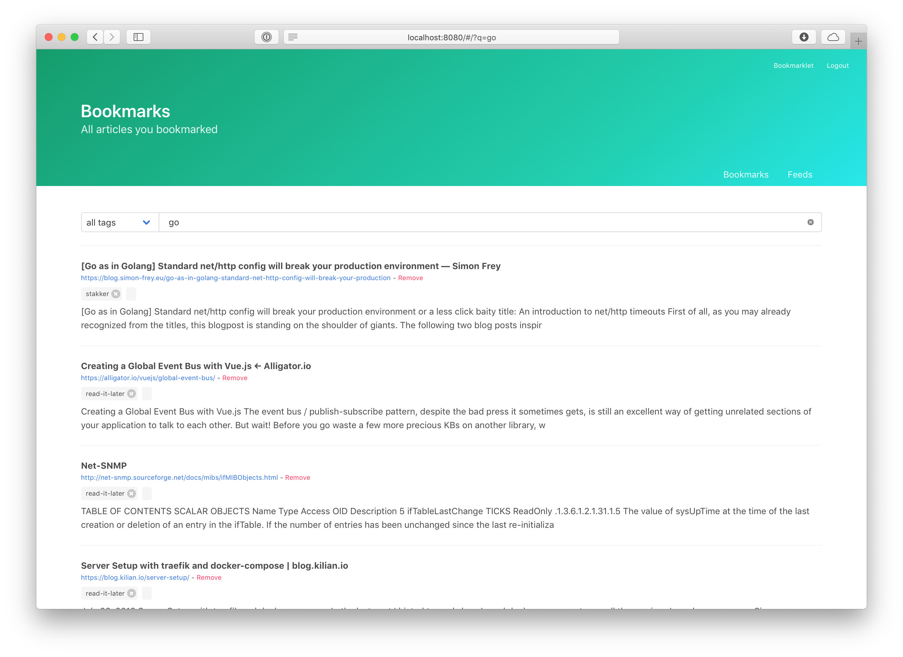

bookmarks
=========

Personal zero-touch bookmarking app in the cloud, with full text search support.

Disclaimer!
-----------

This open source project is not primarily a `zero-touch bookmarking app`. It
is more a personal playground for me to apply concepts I am learning about
`go`, `vue` software engineering. From one day to other this project can
change in ways you would not expect. And the next day it might change back.

Refer to https://github.com/nrocco/bookmarks/issues/23

Installation
------------

First clone this git repository:

    $ git clone https://github.com/nrocco/bookmarks.git

Then compile

    $ make

Now you can run bookmarks server:

    $ build/bookmarks-darwin-amd64

Usage
-----

Alernatively you can use the docker container:

    $ docker run -p 3000:3000 nrocco/bookmarks

Authentication
--------------

By default the app is not protected with a username/password. If you must
protect your bookmarks you can do:

    $ build/bookmarks-darwin-amd64 server --username "xxx" --password ="yyy"

Or when using docker

    $ docker run -p 3000:3000 -e "BOOKMARKS_USERNAME=xxx" -e "BOOKMARKS_PASSWORD=yyy" nrocco/bookmarks

Or when using docker-compose:

    ...
    services:
      bookmarks:
        image: nrocco/bookmarks
        environment:
          BOOKMARKS_USERNAME: xxx
          BOOKMARKS_PASSWORD: yyy
    ...

Contributing
------------

1. Fork it
2. Create your feature branch (`git checkout -b my-new-feature`)
3. Commit your changes (`git commit -am 'Add some feature'`)
4. Make sure that tests pass (`make test`)
5. Push to the branch (`git push origin my-new-feature`)
6. Create new Pull Request

Contributors
------------

- Nico Di Rocco (https://github.com/nrocco)
